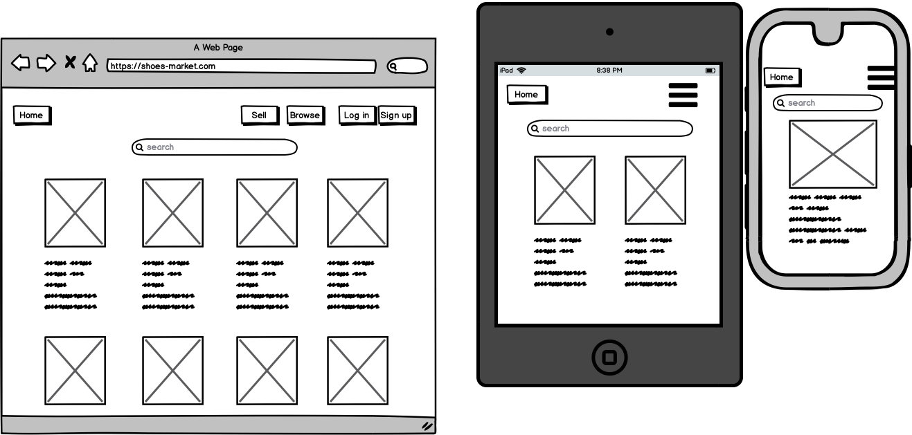

<h1>Hoang Hai Ho -T2A2 

<h2>Shoes market- Ruby on Rails two-sided marketplace application

<h3>Deployed app: https://shoes-market-x.herokuapp.com/
<h3>GitHub : https://github.com/hai14894/Sneaker-Market-Rails

<h3>1.Explain the different high-level components (abstractions) in your App.

Shoes market is a two-sided marketplace application that was built using Ruby on Rails framework and architected using MVC (Model, View, Controller) where the View with minimal logic display user interface in the front-end. In the back-end,Controller accepts user input and converts it to commands for the Model or View. Model manages the data, logic and rules of the application, which Postgresql is the data base of choice.

 User authorization, authentication and data sanitizing methods are applied for better user experience and to protect to app from malicious activities.
<h3>2. List and describe any 3rd party services.

Devise: this Ruby gem is added to provide user authentication, the process of determining whether someone who declares themselves to be, it allows my application to verify and give access to the resources to the user. When a user visit the site , if they are not logged in , they can only see parts of the site. Only when they signed up they can view a listing, create, edit or destroy the listing they create.

Stripe: The Stripe API provides a safe, easy and user friendly payment service within the app but all the monetary transactions are handled by Stripe outside the app, which makes customer feel safer.

Amazon S3: Cloud service that stores the images that user upload to the site.

Randsack: Ruby gem that used for the search function, based on the `_cont` we give it.

Bootstrap Framework: is used for styling the web application.

<h3>3.1 Identify the problem you’re trying to solve by building this particular marketplace App?

 The shoes industry is booming and there's no platform where buyer and seller can easily buy and sell shoes. Shoes market is a platform where shoes buyer and seller can easily find the shoes they like and buy it, as well as selling the shoes they own, whether it's used or brand new.

<h3>3.2 Why is the problem identified a problem that needs solving?

Usually to buy and sell shoes, people have to go on social media platform or other marketplace like Gumtree or Ebay, which is not just dedicated to shoes. Since then it is time-consuming to locate the shoes people want. The Shoes Marketplace is to provide a platform  where you can find and sell the you you want , fast and easy with the search function and the transactions are secured by the website.

<h3>4. Describe your project’s models in terms of the relationships (active record associations) they have with each other.

 A user `has_many` listings , a listing `belongs_to` user.

  A listing `has_many_attached` pictures, a picture `belongs_to` a listing.

 A listing `belongs_to` a location, through Location table.

 A listing `belongs_to` a size, through Size table.

<h3>5. Discuss the database relations to be implemented.

<h3>6. Provide your database schema design.

<h3>7. Provide User stories for your App.
<h4>User management: 

As a site visitor, I want to be able to create an account in order to become a buyer and seller.

As a buyer or seller, I want to be able to log in and log out of my account at any time.

As a buyer or seller, I want to be able to edit my account password.

As a buyer or seller, I want to be able to delete my account if i don't  want to use the app anymore.
<h4>Listing management:

As a site visitor, I want to be able to see all the listings without logging in.

As a seller, I want to be able to create listings in order to sell my shoes.

As a seller, I want to be able to upload multiple pictures to my listings.

As a seller, I want to be able to show, edit and delete my listings.

As a buyer, I want to be able to search for shoes with the brand or model i am looking for.

As a buyer, I want to be able to show the details of listing.
<h4>Authentication & Authorisation:

As a buyer or seller, I do not want other users to be able to access my account.

As a seller, I do not want other users to be able to edit or delete my listings.
<pdocs>As a seller, I do not want to see options to buy my listings.

<h3>8. Provide Wireframes for your App.

<h3>9. Describe the way tasks are planned and tracked in your project.

<h3>10. ERD provided represents a normalised database model.

