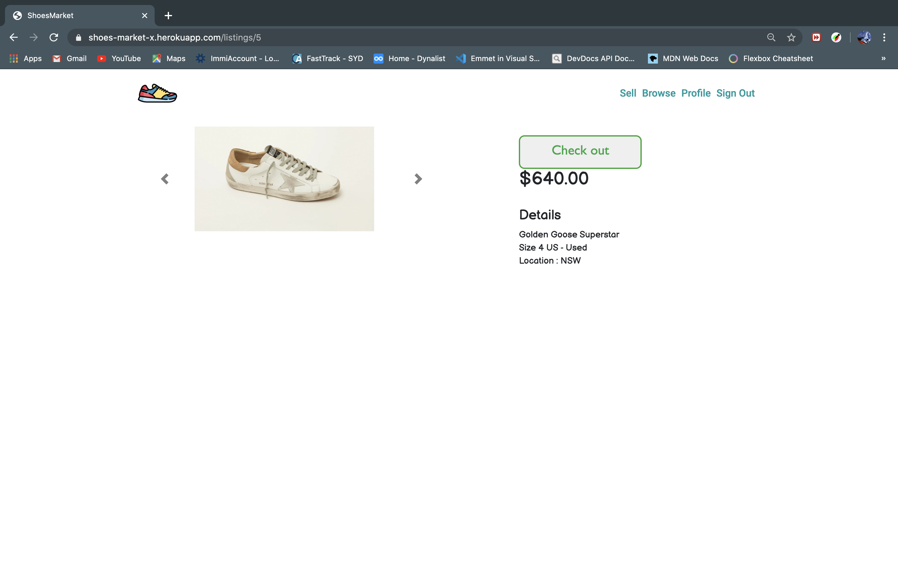

# Hoang Hai Ho -T2A2 
## Shoes market- Ruby on Rails two-sided marketplace application

### Link to the deployed app: https://shoes-market-x.herokuapp.com/
### Link to github repo: https://github.com/hai14894/Sneaker-Market-Rails

## Section 1: Requirement checklist 

Each time you have completed a requirement check it off the list. This way it will be easy for the educators as well as yourselves to track your progress.


- [x] 1. Create your app using Ruby on Rails.
- [x] 2. Use Postgresql database in development and production.
- [x] 3. My app has authentication (eg. Devise).
- [x] 4. My app has authorisation (i.e. users have restrictions on what they can see and edit).
- [x] 5. My app has some type of file (eg. images) uploading capability.
- [x] 6. My app is deployed to Heroku (recommended) or AWS.
- [x] 7. I have identified the problem I am trying to solve by building this particular marketplace app.
- [x] 8. I have explained why is it a problem that needs solving.
- [x] 9. I have provided a link (URL) to my deployed app (i.e. website)
- [x] 10. I have provided a link to my GitHub repository (repo). I have ensured the repo is accessible by my Educators.
- [x] 11. I have a complete description of my marketplace app (website), including:  
        - 11.1 Purpose  
        - 11.2 Functionality / features  
        - 11.3 Sitemap  
        - 11.4 Screenshots  
        - 11.5 Target audience  
        - 11.6 Tech stack (e.g. html, css, deployment platform, etc)  

- [x] 12. I have provided user stories for my app
- [x] 13. I have provided Wire-Frames for my app 
- [x] 14. I have provided an ERD for my app
- [x] 15. I have explained the different high-level components (abstractions) in my app
- [x] 16. I have listed and described any third party services that your app will use
- [x] 17. I have described my projects models in terms of the relationships (active record associations) they have with each other.
- [x] 18. I have discussed the database relations to be implemented in my application
- [x] 19. I have provided my database schema design
- [x] 20. I have described the way tasks are allocated and tracked in my project

NB Slide/Presentation specific requirements

- [x] 21. An outline of the problem I solved by building this particular marketplace app, and why it’s a problem that needs solving.
- [x] 22. A well planned walkthrough of my app
- [x] 23. I have practiced my presentation at least once and it is 5-6 minutes long. 


## Section 2: Documentation 


### Explain the different high-level components (abstractions) in your App.

Shoes market is a two-sided marketplace application that was built using Ruby on Rails framework and architected using MVC (Model, View, Controller) where the View with minimal logic display user interface in the front-end. In the back-end,Controller accepts user input and converts it to commands for the Model or View. Model manages the data, logic and rules of the application, which Postgresql is the data base of choice.
User authorization, authentication and data sanitizing methods are applied for better user experience and to protect to app from malicious activities.
## Description of my marketplace app
### Purpose.
The purpose of this application is to provide a central marketplace for people who want to buy and sell their shoes.
### Functionality / features  
* User can create account and must be logged in for full site functionality, including creating listings, edit and delete them (in the profile page), and purchase them. If user are not logged in , they can only view all the listings but cannot view an individual listing.
* Listings can be searched by brand or model `_cont`, and being displayed.
* Listings can have multiple picture and showed as slides.

### Site map.

***
### Website screenshots
Home page

All listings

Show listing

Edit Profile


***
### Target audience:
The target audience for this application are people with interested in shoes, who want to purchase and sell their shoes.
### Tech stack:
**Front-end:** HTML5, CSS3, Embedded Ruby, Bootstrap, 

**Back-end:** Ruby, Ruby on Rails

**Database:** Postgresql, D-Beaver.

**Deployment:** Heroku.

**Biz Tools:** Trello, Slack.

**Utilities:** Stripe, Devise, Ultrahook, AWS S3.

**DevOps:** Git, Github, VS Code, Balsamiq.


### List and describe any 3rd party services.

**Devise**: this Ruby gem is added to provide user authentication, the process of determining whether someone who declares themselves to be, it allows my application to verify and give access to the resources to the user. When a user visit the site , if they are not logged in , they can only see parts of the site. Only when they signed up they can view a listing, create, edit or destroy the listing they create.

**Stripe**: The Stripe API provides a safe, easy and user friendly payment service within the app but all the monetary transactions are handled by Stripe outside the app, which makes customer feel safer.

**Amazon S3**: Cloud service that stores the images that user upload to the site.

**Randsack**: Ruby gem that used for the search function, based on the `_cont` we give it.

**Bootstrap Framework**: is used for styling the web application.


## Identify the problem you’re trying to solve by building this particular marketplace App?

 The shoes industry is booming and there's no platform where buyer and seller can easily buy and sell shoes. Shoes market is a platform where shoes buyer and seller can easily find the shoes they like and buy it, as well as selling the shoes they own, whether it's used or brand new.

## Why is the problem identified a problem that needs solving?

Usually to buy and sell shoes, people have to go on social media platform or other marketplace like Gumtree or Ebay, which is not just dedicated to shoes. Since then it is time-consuming to locate the shoes people want. The Shoes Marketplace is to provide a platform  where you can find and sell the you you want , fast and easy with the search function and the transactions are secured by the website.

## Describe your project’s models in terms of the relationships (active record associations) they have with each other.

A user has_many listings , a listing `belongs_to` user.
A listing `has_many_attached` pictures, a picture `belongs_to` a listing.
A listing `belongs_to` a location, through Location table.
A listing `belongs_to` a size, through Size table.
```
    class Listing < ApplicationRecord
        enum condition: {New: 1, Used: 0}
        belongs_to :location 
        belongs_to :user
        belongs_to :size
        has_many_attached :picture
    end

    class User < ApplicationRecord
        has_many :listings, dependent: :destroy
    end

    class Size < ApplicationRecord
         has_many :listings, dependent: :destroy  
    end

    class Location < ApplicationRecord
        has_many :listings, dependent: :destroy
    end
```
***
## Discuss the database relations to be implemented.

* User has one relation to the Listing table. The primary key in user table (user_id) is used as a foreign key in listing table and this is for data normalisation.

* Just like user, location and size also has one relation to the listing, their primary keys are used as foreign keys in listing table.

* Listing belongs to many tables such as User, size and location. The primary keys in the User table(user_id), Size table (size_id) and location table(location_id) are used as foreign keys in the listing table. 

* Active record: The active storage tables are polymorphic and relate to images upload. A listing can have many pictures. No reference to this polymorphic association is made listing table however a `has_many_attached` relationship is defined in the listing model.

## Provide your database schema design.
Each table within the database also contains a table reference id and the following two attributes: ```created_at: datetime``` and ```updated_at: datetime``` 

**User**
```
    email: string
    password: string
    reset_password_token: string
```
**Listing**
```
    user_id: references
    brand: string
    model: string
    condition: string
    price: integer
    description: text
    size_id: bigint
    location_id: bigint 
```
**Location**
```
    state: string
```
**Size**
```
    size:integer
```


## Provide User stories for your App.
**User management**: 
 As a site visitor, I want to be able to create an account in order to become a buyer and seller.
As a buyer or seller, I want to be able to log in and log out of my account at any time.
As a buyer or seller, I want to be able to edit my account password.
As a buyer or seller, I want to be able to delete my account if i don't  want to use the app anymore.
**Listing management**:
As a site visitor, I want to be able to see all the listings without logging in.
As a seller, I want to be able to create listings in order to sell my shoes.
As a seller, I want to be able to upload multiple pictures to my listings.
As a seller, I want to be able to show, edit and delete my listings.
As a buyer, I want to be able to search for shoes with the brand or model i am looking for.
As a buyer, I want to be able to show the details of listing.
**Authentication & Authorisation**:
As a buyer or seller, I do not want other users to be able to access my account.
As a seller, I do not want other users to be able to edit or delete my listings.
As a seller, I do not want to see options to buy my listings.

## Provide Wireframes for your App.


## Describe the way tasks are planned and tracked in your project.


The project is tracked and managed by using Trello. I began by planning out and finish the MVP, Ruby on Rails that have full CRUD functionality , user authentication using Devise and image upload using AWS S3 bucket and Stripe check out. After finishing the MVP, i move on to the features like search, upload multiple images and show them on slides, as well as style my pages.

## ERD provided represents a normalised database model.


